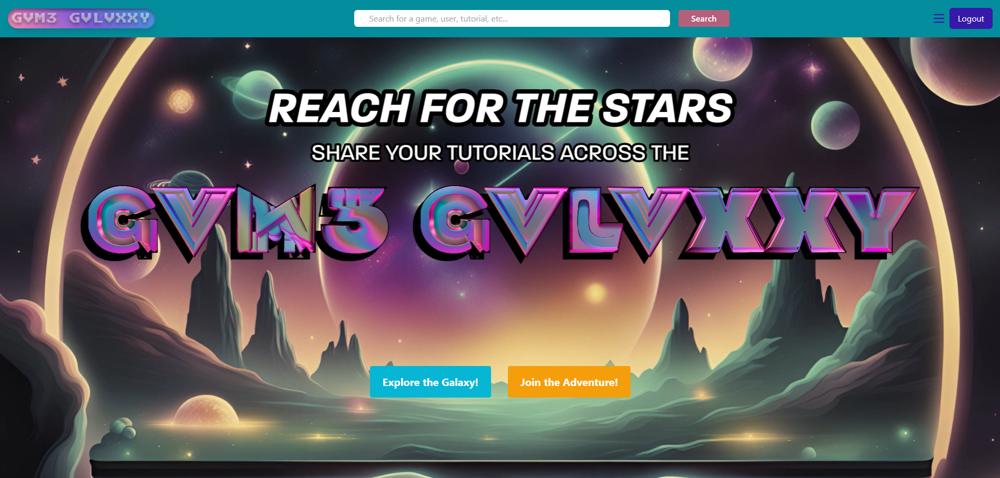
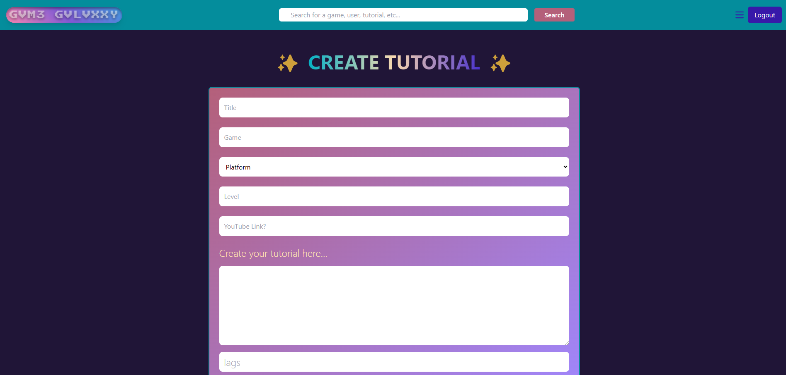

# 🕹️ GVM3 GVLVXXY 🌌

___

## Description
🌟Welcome to GVME GVLVXXY: Your Portal to Mastering Games🌟
Game Galaxxy is a web-based platform designed to host and showcase game tutorials. Whether you're stuck on a level or looking for the best strategies, Game Galaxxy connects gamers with the content they need to succeed. From easy tips to galactically impossible challenges, explore, save, and share tutorials that make you a better gamer.

___

## Table of Contents
- [🕹️ GVM3 GVLVXXY 🌌](#️-gvm3-gvlvxxy-)
  - [Description](#description)
  - [Table of Contents](#table-of-contents)
  - [Screenshots](#screenshots)
  - [Usage](#usage)
  - [Deployment](#deployment)
  - [License](#license)
  - [Tech Used](#tech-used)
  - [Credits](#credits)

___

## Screenshots
Here’s a preview of what you can expect from Game Galaxxy:

___

## Usage

Click and navigate your way through the galaxy of gaming! Click the "Login" button and sign up to make your own profile. Create your own gaming guides to share with friends and search for others you are interested in! Connect with other creators through our blog and get gaming!
___

## Deployment

Here is a link to the deployed application using Render.
(https://game-galaxxy.onrender.com/) 
___

## License

___

## Tech Used

- React
- Tailwind
- Axios
- Apollo
- GraphQL
- Node.js
- Express.js
- MongoDB
- Mongoose ODM
- IGDB API
- Render
___

## Credits

Developers:
- [Tish Sirface](https://github.com/ThisTish)
- [Karina Gonzalez](https://github.com/2023kgl)
- [Taylor Betzaida](https://github.com/Betzaida96)
- [Beth McKinney](https://github.com/macbetthh)
- [Tristan Smith](https://github.com/TristanSmith63)
- [Kyle Kirby](https://github.com/TheKyleKirby)

___
